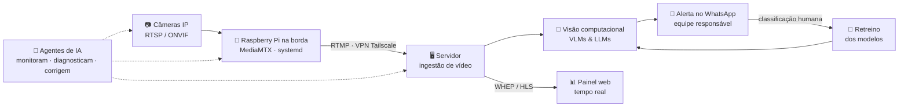
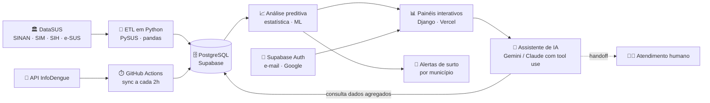
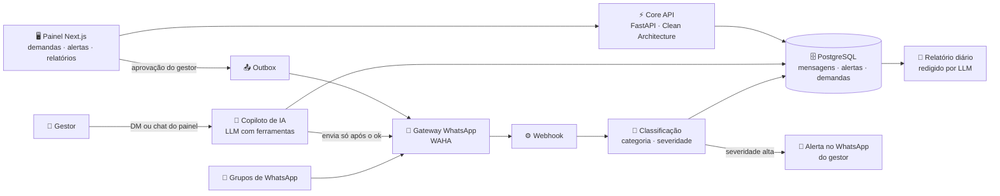

<!-- ======================= BANNER ======================= -->


<!-- ======================= TYPING ======================= -->
<div align="center">

[](https://git.io/typing-svg)

<!-- ======================= SOCIALS ======================= -->
<a href="https://www.linkedin.com/in/jos%C3%A9-domingues1/"></a>
<a href="https://josedomingues.digital"></a>
<a href="mailto:contato@josedomingues.digital"></a>


</div>

<br/>

<!-- ======================= SOBRE ======================= -->
## 🚀 Sobre mim

```yaml
nome:        José Otilio Domingues dos Santos
cargo:       Desenvolvedor Full-Stack @ Mindloop.ia (SmartRanch)
localização: São Paulo, Brasil 🇧🇷
foco:        Visão Computacional • LLMs & Agentes de IA • Edge / Streaming de vídeo
estudando:   Ciência de Dados @ FIAP
lema:        "Fazer a IA sair do slide e funcionar em campo, 24h por dia"
```

- 🐴 Integro a equipe do **SmartRanch**, plataforma de monitoramento de equinos por **visão computacional** que avisa a equipe antes que um problema vire emergência — sinais de cólica, indícios de parto, mudanças de comportamento
- 🎥 Cuido do ciclo completo: capturar o vídeo, transportá-lo com baixa latência, analisá-lo com **modelos de visão e LLMs**, entregar o alerta no **WhatsApp** e usar a resposta humana para **retreinar o modelo**
- 🤖 Escrevo **agentes de IA em Python** que monitoram infraestrutura, diagnosticam falhas e corrigem sozinhos — e publico essa linha de trabalho aqui, em repositórios abertos
- 🩺 Projeto próprio: **Saúde Inteligente**, plataforma que transforma os dados abertos do DataSUS em alertas antecipados de surtos e epidemias
- ☁️ Certificado em fundamentos de nuvem pela **AWS** e pelo **Google Cloud**

<br/>

<!-- ======================= PROJETOS ======================= -->
## 🌐 Projetos em destaque

### 🐴 [SmartRanch](https://smartranch.com.br) — *Tecnologia que cuida*
Plataforma que usa inteligência artificial para **monitorar em tempo real o comportamento e a saúde dos animais**. Por análise de imagens, o sistema identifica anormalidades que possam trazer risco e **gera alertas imediatos**, além de oferecer ferramentas de gestão e controle para os proprietários e uma área dedicada ao veterinário.<br/>
`Visão computacional` `VLMs & LLMs` `Streaming de vídeo` `Alertas em tempo real` · [**ver site →**](https://smartranch.com.br)

### 🏢 [Preposto IA](https://preposto.ai) — *Seu WhatsApp em ordem. Suas demandas sob controle.*
Central operacional para **síndicos**. Resume as conversas dos grupos de WhatsApp, separa urgência, dúvida e solicitação, e transforma pedidos em **demandas com responsável, prazo e status**, ligadas à conversa de origem. Mantém cada condomínio no seu contexto (moradores, unidades, fornecedores, documentos) e prepara respostas apoiadas no histórico e nos documentos, sempre com a confirmação final do síndico. Inclui documentos com OCR e RAG, avisos, CRM, financeiro, manutenção preventiva, **assembleias com votação por fração ideal**, assistente de voz e auditoria de ações sensíveis.<br/>
`Next.js` `Supabase` `OpenAI` `RAG` `WhatsApp` · [**ver site →**](https://preposto.ai)

### 🩺 [Saúde Inteligente](https://saude-inteligente-seven.vercel.app) — *Dados do SUS a favor da prevenção*
Plataforma de ciência de dados aplicada à saúde pública brasileira que **transforma os dados abertos do DataSUS em alertas antes que a crise aconteça**. Coleta e cruza as bases SINAN, SIM, SIH e e-SUS Notifica num modelo único de dados e usa modelos estatísticos e de machine learning para apontar desvios e curvas de crescimento, revelando os **primeiros sinais de surtos e epidemias** por município. Painéis interativos para gestores, pesquisadores e cidadãos, sem coletar nenhum dado novo do cidadão.<br/>
`Python` `Django` `ETL de dados abertos` `Machine Learning` `Dashboards` · [**ver site →**](https://saude-inteligente-seven.vercel.app)

### 🖧 [ABDC — Associação Brasileira de Data Center](https://datacenter.org.br)
Portal da organização sem fins lucrativos que **integra e representa toda a cadeia produtiva da indústria de data centers no Brasil**. Reúne as iniciativas da associação (educação, relações governamentais, pesquisa e grupos de trabalho em energia, sustentabilidade e regulação), notícias, treinamentos online e presenciais, agenda de eventos, guia de soluções dos associados e mapa de data centers, em português e inglês.<br/>
`WordPress` `Elementor` `Área de associados` · [**ver site →**](https://datacenter.org.br)

<br/>

## 🤖 Agentes de IA open source

Uma família de agentes para **observabilidade de vídeo em produção**: cada um responde a uma pergunta que o painel de câmeras não responde sozinho. Todos têm **modo demo** (`python3 -m demo.gerar`), com dados fictícios passando pelo mesmo código de produção, sem banco e sem chave.

| Agente | O que faz |
|---|---|
| [**agente-monitor-cameras**](https://github.com/zezinDomingues/agente-monitor-cameras) | **A imagem está no ar?** Três vezes por dia varre o parque de câmeras, prova com duas fontes independentes (API do MediaMTX + sonda WHEP) quais estão sem imagem e por quê, distingue 14 causas e envia um PDF agrupado por cliente no WhatsApp. Varre 199 câmeras em ~7 s |
| [**agente-monitor-gravacoes**](https://github.com/zezinDomingues/agente-monitor-gravacoes) | **A imagem está sendo guardada?** Confere se a gravação de cada câmera está chegando ao disco, mede a cobertura do dia e separa a culpa: câmera no ar sem arquivo é o **gravador**; câmera fora é a **fonte**. Painel ao vivo em FastAPI |
| [**agente-validador-internet**](https://github.com/zezinDomingues/agente-validador-internet) | **A imagem está chegando inteira?** Mede quantos frames por segundo a plataforma realmente recebe de cada câmera, classifica a conexão (travada, intermitente, fluxo crítico, fluxo baixo, saudável) com pontuação e evidências, e gera um PDF por cliente com problema de internet |
| [**agente-ajuste-janela**](https://github.com/zezinDomingues/agente-ajuste-janela) | **O primeiro que age.** Lê a qualidade da internet de cada câmera e reescreve as janelas de entrada e saída da detecção, para que a troca de status volte a acontecer mesmo com link ruim. Escrita travada por padrão, auditável e reversível |
| [**agente-validador-notificacoes**](https://github.com/zezinDomingues/agente-validador-notificacoes) | Anota sozinho, 24h por dia, se cada alerta de detecção era **verdadeiro ou falso**: faz a uma VLM (NVIDIA NIM / Nemotron) uma pergunta objetiva por tipo de alerta, com recorte na ROI da câmera. Painel de acerto por classe e bancada para ajustar prompts. Escrita em produção impossível por desenho |
| [**Agente-varredura-conserto-cameras**](https://github.com/zezinDomingues/Agente-varredura-conserto-cameras) | Vigia câmeras IP no Raspberry Pi e, quando uma cai, **diagnostica e conserta sozinho**: recria o path, reinicia o relay, redescobre o IP por ARP/ONVIF, sob seis travas de segurança. Esgotadas as tentativas, escala para o Claude Code com acesso por lista fechada. Usa 0,4% de um núcleo e 26 MB de RAM |

<br/>

<!-- ======================= STACK ======================= -->
## 🛠️ Tech Stack

<div align="center">

### Linguagens & Back-end


### Dados, Infra & Borda


### Cloud & Ferramentas


### Vídeo, Rede & IA


</div>

<br/>

<!-- ======================= EXPERIÊNCIA ======================= -->
## 💼 Experiência

> ### 🐴 Mindloop.ia · SmartRanch — Desenvolvedor Full-Stack · `jul/2026 – atual`
> Plataforma de monitoramento de equinos por IA, 24/7, com câmeras e sensores térmicos e de batimentos cardíacos: identifica sinais de cólica, indícios de parto e mudanças de comportamento (postura em pé/deitado, dentro/fora da baia, presença humana). **VLMs e LLMs** transformam o vídeo em alertas enviados em tempo real à hípica via **WhatsApp**, e a classificação humana de cada alerta realimenta o retreino dos modelos.
>
> - Responsável pelo **pipeline de vídeo ponta a ponta**: captura RTSP/ONVIF → ingestão RTMP → entrega WHEP/HLS de baixa latência no painel web
> - **Infraestrutura de borda** em ambiente rural: Raspberry Pi e mini-PCs em campo, MediaMTX, serviços systemd, rede MikroTik e VPN Tailscale
> - Diagnóstico e correção de falhas nos streams (quedas de câmera, perda de sincronismo, rede fora) — hoje **automatizados por agentes de IA** que monitoram e corrigem sozinhos
> - Back-end com **Python, APIs de integração, PostgreSQL/Supabase** e automação de notificações

> ### 🌐 2WP — Desenvolvedor Web Júnior · `ago/2025 – jul/2026`
> Sites, blogs, portais de notícias, SaaS e softwares web personalizados. Ciclo de vida completo dos projetos, **performance e segurança** (remediação de vulnerabilidades) e alta disponibilidade com **PHP, MySQL, WordPress, HTML e CSS**.

<br/>

<!-- ======================= FORMAÇÃO ======================= -->
## 🎓 Formação & Certificações

<table>
<tr>
<td width="50%" valign="top">

**🏫 Formação**
- **FIAP** — CST em Ciência de Dados `jan/2026 – nov/2027`
- **SENAI SP** — Técnico em Análise e Desenvolvimento de Sistemas `fev/2024 – nov/2025`

</td>
<td width="50%" valign="top">

**📜 Certificações**
- Python Essentials 1 (Cisco)
- Google Cloud Computing Foundations
- AWS Academy Graduate — Cloud Foundations
- Set Up an App Dev Environment on Google Cloud (Skill Badge)
- Algoritmos: Aprenda a Programar

</td>
</tr>
</table>

<br/>

<!-- ======================= ARQUITETURA ======================= -->
## 🧭 Arquitetura dos projetos

### 🎥 Monitoramento por visão computacional

> Da câmera ao WhatsApp: o caminho do vídeo numa aplicação de visão computacional em tempo real, e os agentes de IA que mantêm cada etapa de pé.



### 🩺 Saúde Inteligente

> Dos dados abertos do SUS ao alerta de surto: ingestão automática, modelo único no PostgreSQL, análise e um assistente de IA que responde sobre os números.



### 💬 Gestão via WhatsApp

> Da conversa à demanda resolvida: o agente escuta os grupos, classifica e avisa; o gestor pergunta, aprova e só então a mensagem sai.



<br/>

<!-- ======================= FOOTER ======================= -->

