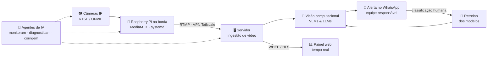

<!-- ======================= BANNER ======================= -->


<!-- ======================= TYPING ======================= -->
<div align="center">

[](https://git.io/typing-svg)

<!-- ======================= SOCIALS ======================= -->
<a href="https://www.linkedin.com/in/jos%C3%A9-domingues1/"></a>
<a href="https://josedomingues.digital"></a>
<a href="mailto:contato@josedomingues.digital"></a>


</div>

<br/>

<!-- ======================= SOBRE ======================= -->
## 🚀 Sobre mim

```yaml
nome:        José Otilio Domingues dos Santos
cargo:       Desenvolvedor Full-Stack @ Mindloop.ia (SmartRanch)
localização: São Paulo, Brasil 🇧🇷
foco:        Visão Computacional • LLMs & Agentes de IA • Edge / Streaming de vídeo
estudando:   Ciência de Dados @ FIAP
lema:        "Fazer a IA sair do slide e funcionar em campo, 24h por dia"
```

- 🐴 Integro a equipe do **SmartRanch**, plataforma de monitoramento de equinos por **visão computacional** que avisa a equipe antes que um problema vire emergência — sinais de cólica, indícios de parto, mudanças de comportamento
- 🎥 Cuido do ciclo completo: capturar o vídeo, transportá-lo com baixa latência, analisá-lo com **modelos de visão e LLMs**, entregar o alerta no **WhatsApp** e usar a resposta humana para **retreinar o modelo**
- 🤖 Escrevo **agentes de IA em Python** que monitoram infraestrutura, diagnosticam falhas e corrigem sozinhos — e publico essa linha de trabalho aqui, em repositórios abertos
- 🩺 Projeto próprio: **Saúde Inteligente**, aplicação Django multiagente na área da saúde, do banco de dados ao deploy
- ☁️ Certificado em fundamentos de nuvem pela **AWS** e pelo **Google Cloud**

<br/>

<!-- ======================= PROJETOS ======================= -->
## 🤖 Projetos em destaque

| Projeto | O que faz |
|---|---|
| [**SmartRanch**](https://smartranch.com.br) 🌐 | Plataforma de monitoramento de equinos por IA — visão computacional, VLMs/LLMs e alertas no WhatsApp. Atuo no pipeline de vídeo, borda e agentes — [ver site](https://smartranch.com.br) |
| [**Preposto IA**](https://preposto.ai) 🌐 | Central operacional para síndicos: organiza as mensagens do WhatsApp, transforma conversas em demandas e acompanha responsáveis e respostas por condomínio (Next.js, Supabase, OpenAI). — [ver site](https://preposto.ai) |
| [**ABDC — Associação Brasileira de Data Center**](https://datacenter.org.br) 🌐 | Portal institucional da associação: iniciativas, notícias, treinamentos e eventos, desenvolvido em WordPress — [ver site](https://datacenter.org.br) |
| [**Saúde Inteligente**](https://saude-inteligente-seven.vercel.app) 🌐 | Aplicação Django multiagente na área da saúde, do banco ao deploy — [ver no ar](https://saude-inteligente-seven.vercel.app) |
| [**agente-monitor-cameras**](https://github.com/zezinDomingues/agente-monitor-cameras) | Diagnostica um parque de câmeras (a câmera está no ar?) e gera relatório em PDF por cliente |
| [**agente-monitor-gravacoes**](https://github.com/zezinDomingues/agente-monitor-gravacoes) | Confere se as gravações estão de fato sendo guardadas |
| [**agente-validador-internet**](https://github.com/zezinDomingues/agente-validador-internet) | Mede o fluxo de frames por câmera e classifica a qualidade da conexão |
| [**agente-ajuste-janela**](https://github.com/zezinDomingues/agente-ajuste-janela) | Recalibra as janelas de detecção conforme a rede, para a IA continuar decidindo certo sob conexão ruim |
| [**agente-validador-notificacoes**](https://github.com/zezinDomingues/agente-validador-notificacoes) | Valida alertas de detecção antes de chegarem ao usuário |
| [**Agente-varredura-conserto-cameras**](https://github.com/zezinDomingues/Agente-varredura-conserto-cameras) | Vigia as câmeras na borda e corrige sozinho as falhas antes de escalar para um humano |

> Os agentes têm **modo demo** (`python3 -m demo.gerar`): dados fictícios passando pela mesma lógica de produção, sem banco e sem chave.

<br/>

<!-- ======================= STACK ======================= -->
## 🛠️ Tech Stack

<div align="center">

### Linguagens & Back-end


### Dados, Infra & Borda


### Cloud & Ferramentas


### Vídeo, Rede & IA


</div>

<br/>

<!-- ======================= EXPERIÊNCIA ======================= -->
## 💼 Experiência

> ### 🐴 Mindloop.ia · SmartRanch — Desenvolvedor Full-Stack · `jul/2026 – atual`
> Plataforma de monitoramento de equinos por IA, 24/7, com câmeras e sensores térmicos e de batimentos cardíacos: identifica sinais de cólica, indícios de parto e mudanças de comportamento (postura em pé/deitado, dentro/fora da baia, presença humana). **VLMs e LLMs** transformam o vídeo em alertas enviados em tempo real à hípica via **WhatsApp**, e a classificação humana de cada alerta realimenta o retreino dos modelos.
>
> - Responsável pelo **pipeline de vídeo ponta a ponta**: captura RTSP/ONVIF → ingestão RTMP → entrega WHEP/HLS de baixa latência no painel web
> - **Infraestrutura de borda** em ambiente rural: Raspberry Pi e mini-PCs em campo, MediaMTX, serviços systemd, rede MikroTik e VPN Tailscale
> - Diagnóstico e correção de falhas nos streams (quedas de câmera, perda de sincronismo, rede fora) — hoje **automatizados por agentes de IA** que monitoram e corrigem sozinhos
> - Back-end com **Python, APIs de integração, PostgreSQL/Supabase** e automação de notificações

> ### 🌐 2WP — Desenvolvedor Web Júnior · `ago/2025 – jul/2026`
> Sites, blogs, portais de notícias, SaaS e softwares web personalizados. Ciclo de vida completo dos projetos, **performance e segurança** (remediação de vulnerabilidades) e alta disponibilidade com **PHP, MySQL, WordPress, HTML e CSS**.

<br/>

<!-- ======================= FORMAÇÃO ======================= -->
## 🎓 Formação & Certificações

<table>
<tr>
<td width="50%" valign="top">

**🏫 Formação**
- **FIAP** — CST em Ciência de Dados `jan/2026 – nov/2027`
- **SENAI SP** — Técnico em Análise e Desenvolvimento de Sistemas `fev/2024 – nov/2025`

</td>
<td width="50%" valign="top">

**📜 Certificações**
- Python Essentials 1 (Cisco)
- Google Cloud Computing Foundations
- AWS Academy Graduate — Cloud Foundations
- Set Up an App Dev Environment on Google Cloud (Skill Badge)
- Algoritmos: Aprenda a Programar

</td>
</tr>
</table>

<br/>

<!-- ======================= ARQUITETURA ======================= -->
## 🧭 O que eu opero em produção

> Da câmera ao WhatsApp: o caminho do vídeo numa aplicação de visão computacional em tempo real, e os agentes de IA que mantêm cada etapa de pé.



<br/>

<!-- ======================= FOOTER ======================= -->

